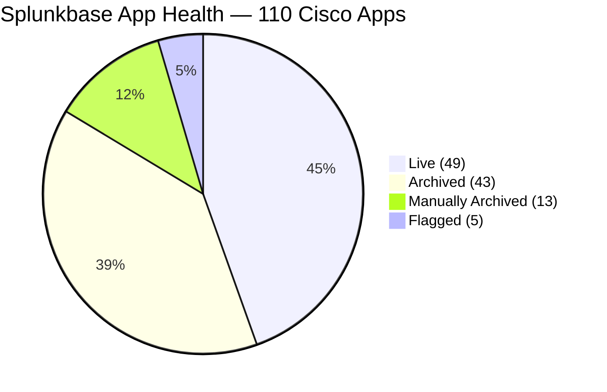
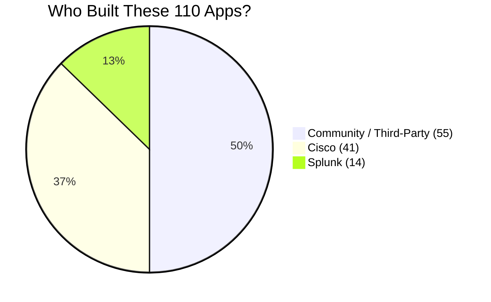
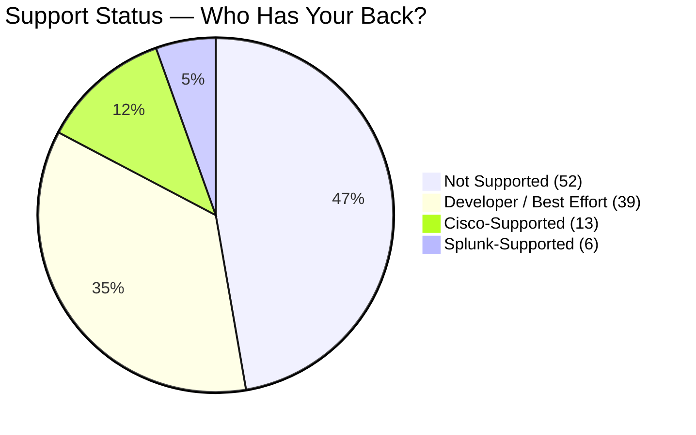
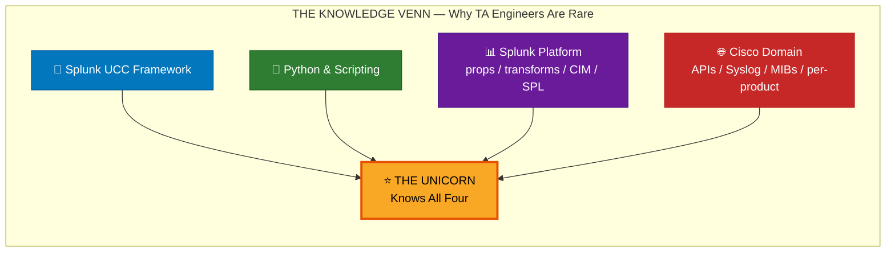
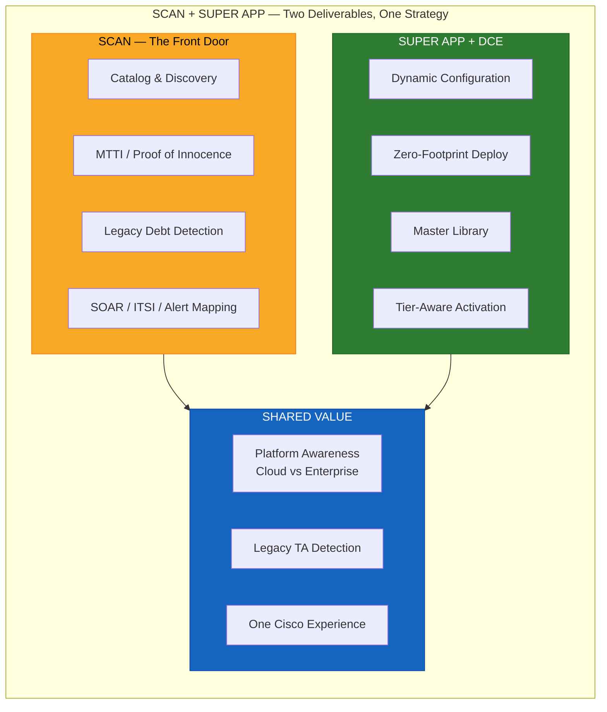
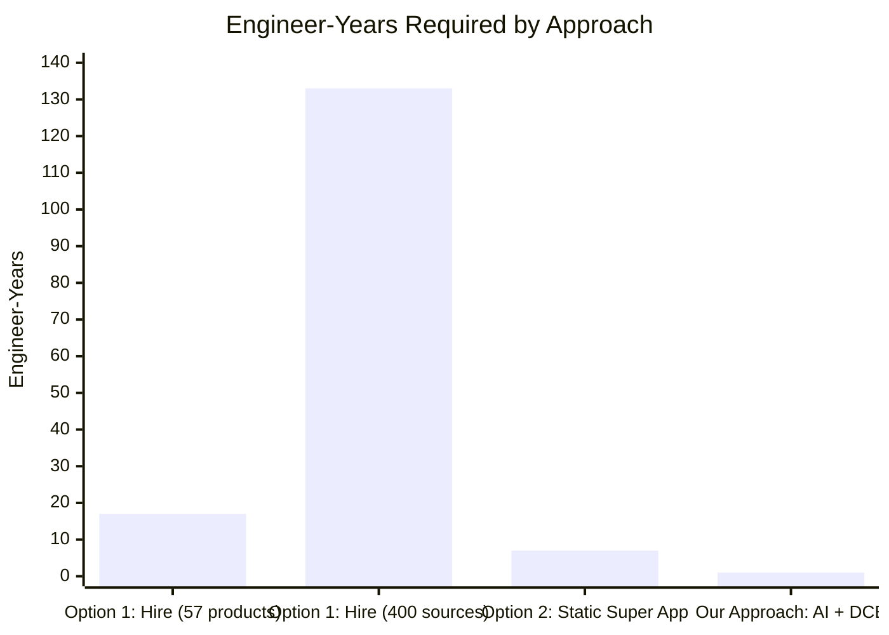
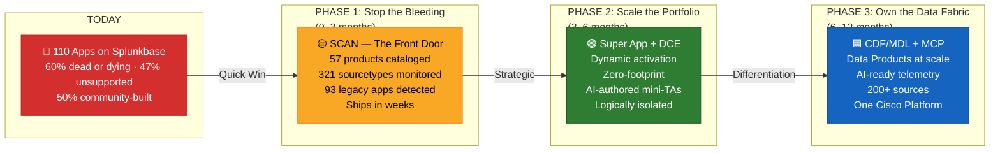
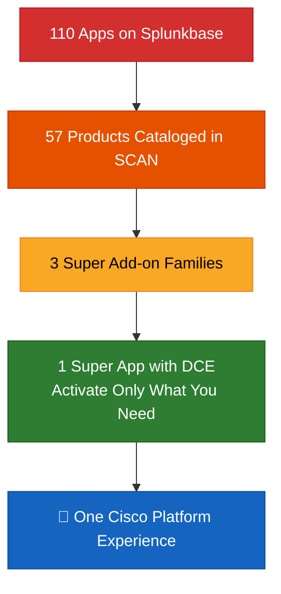

# Cisco-Splunk TA Strategy: Findings, Challenges & The Path Forward

**Engage with Cisco Stakeholders to Re-evaluate Success Factors for TA Authoring & Maintenance**

Alan Ivarson, Group Vice President, Field Solutions
Amir (AK) Khamis, Principal Architect

February 2026 — 45-Minute Presentation

---

## Agenda

1. **The Problem** — The Current State of Cisco Apps & TAs on Splunkbase
2. **Stakeholder Feedback** — Top 10 Challenges & The Magic 6 Best Practices
3. **Why We Can't Hire Our Way Out** — Option 1: Traditional TA Development
4. **Why Bundling Alone Isn't Enough** — Option 2: The Super App (Cisco Security Cloud)
5. **Two Deliverables** — Quick Win (SCAN) + Strategic Play (Cisco Enterprise Networking Super App)
6. **The AI-Powered Path Forward** — Lower Cost, Increase Speed & Quality
7. **Next Steps & Roadmap**

---

## 1. The Problem — 110 Apps, No Clear Answer

> *"If we don't have good integration and data, we can't tell a good story or have full coverage spanning all Cisco products in the portfolio."*

**Strategic Context:** Following alignment with **Kunal Mukerjee (SVP Engineering)** and his "TA Flywheel" vision, our audit reveals that high-fidelity Splunk integrations are the **"Last Mile" of the Cisco Data Fabric (CDF)**. While CDF stores and moves telemetry, its value is realized only when that data is *actionable*. Remediating TAs to a "Gold Standard" is essential for CDF to provide immediate ROI through CIM-compliant normalization — enabling **1,900+ out-of-the-box detections** in Splunk Enterprise Security.

We audited **every** Cisco-related app and add-on on Splunkbase — 125 listings total. Excluding 13 SOAR connectors and 2 prerequisite utilities, **110 apps and add-ons** remain. The results are alarming:

- **47% unsupported** — no vendor backing whatsoever
- **51% archived** — removed from Splunkbase or deliberately pulled
- **50% community-built** — no Cisco QA, no security review
- **74% non-functional, unsupported, or flagged** — only 1 in 4 apps meets a basic quality bar

> **Financial Impact:** Fragmented TAs result in thousands of wasted TAC hours and delayed Time-to-Value for multi-million dollar Enterprise Agreements. Every wrong install is a support ticket, a disappointed customer, and an erosion of confidence in the Cisco-Splunk platform.

### Key Insights — The Numbers That Should Surprise Everyone

| # | Insight | Stat | Why It Matters |
|---|---------|------|----------------|
| 1 | **Ecosystem is mostly dead** | 66 of 110 apps (60%) are archived, deprecated, or flagged | Customers are navigating a graveyard of broken links and stale integrations |
| 2 | **Almost no one has your back** | Only 19 of 110 (17%) are supported by Cisco or Splunk | 83% of the ecosystem runs on hope, not SLAs |
| 3 | **Half the ecosystem is community-built** | 55 of 110 (50%) built by 48 different community developers | Individual hobbyists, no security review, no QA, no accountability |
| 4 | **Massive consolidation opportunity** | 52 apps have named replacements → absorbed by just 15 apps | One Super App (7404) alone replaces 18 separate apps |
| 5 | **16 live apps are ticking time bombs** | 16 of 49 live apps (33%) have zero support | One-third of what's still on the shelf has no owner if it breaks |
| 6 | **5 zombie apps walking Splunkbase** | 5 apps are deprecated but still live & downloadable | Customers are actively installing apps Cisco has officially killed |
| 7 | **Developer-supported > Cisco + Splunk combined** | 39 developer-supported vs. 19 Cisco+Splunk-supported (2×) | Community volunteers carry more of Cisco's brand than Cisco does |
| 8 | **Only 17% are Cisco+Splunk backed** | Cisco: 13, Splunk: 6, everyone else: 91 | For a $28B acquisition, we back fewer than 1 in 5 of our own integrations |

> **The punchline:** 74% of Cisco's Splunkbase ecosystem is non-functional, unsupported, or flagged. Customers searching for "Cisco Firewall" encounter 13 results and have no way to tell which is the right one. **SCAN is the aspirin. The Super App is the cure.**

### Splunkbase Audit: 110 Cisco Apps & Add-ons

| Status | Count | % of Total | Implication |
|--------|------:|:----------:|-------------|
| **Live on Splunkbase** | 49 | 45% | Fewer than half are still available to customers |
| **Archived** | 43 | 39% | Removed from Splunkbase — customers can't find them |
| **Manually archived** | 13 | 12% | Cisco/Splunk deliberately pulled these |
| **Flagged** | 5 | 5% | Splunkbase flagged for quality/compatibility issues |
| **Deprecated** | 13 | 12% | Officially end-of-life — 5 are still live (zombies) |

### Who Supports These Apps?

| Support Level | Apps | % | Risk |
|---------------|-----:|--:|------|
| **Not supported by anyone** | **52** | **47%** | No bug fixes, no security patches, no upgrade path |
| Developer-supported (best effort) | 39 | 35% | Community goodwill only — no SLA |
| Cisco-supported | 13 | 12% | Official Cisco backing |
| Splunk-supported | 6 | 5% | Maintained by Splunk engineering |

### Who Built These Apps?

| Developer | Apps | % | Concern |
|-----------|-----:|--:|---------|
| **Community / third-party** | **55** | **50%** | 48 different developers — individuals, no QA, no security review |
| Cisco (various teams) | 41 | 37% | Fragmented across Cisco Systems, Cisco Security, Cisco EN Programmability, CCX |
| Splunk | 14 | 13% | Some now legacy; pre-date the Super App model |

> **Bottom line:** Of 110 Cisco apps on Splunkbase, **47% are unsupported**, **60% are dead or dying**, and **50% were built by community developers Cisco has never met.** 52 of these apps are already being absorbed by just 15 replacements — the consolidation is happening whether we fund it or not.

### Visual: The Audit at a Glance







---

## 2. The Confusion Problem — A Customer's Real Experience

### Cisco Secure Firewall: 13 Apps, 1 Correct Answer

A customer searching Splunkbase for Cisco Firewall visibility encounters **13 different results**:

| # | App Name | Status | Built By |
|:-:|----------|--------|----------|
| 1 | Splunk Add-on for Cisco FireSIGHT | Archived | Splunk |
| 2 | Cisco Secure eStreamer Client Add-On | Legacy | Cisco |
| 3 | Cisco Firepower eNcore App | Legacy | Community |
| 4 | Cisco Secure Firewall App for Splunk | Superseded | Cisco |
| 5 | Splunk Add-on for Cisco ASA | Legacy | Splunk |
| 6 | Enosys eStreamer Add-on | Legacy | Community |
| 7 | Cisco FTD sourcetype TA | Legacy | Community |
| 8 | Cisco FTD Dashboards | Legacy | Community |
| 9 | Cisco Firepower pcap Add-on | Legacy | Community |
| 10 | Cisco eStreamer Client for Splunk | Legacy | Cisco |
| 11 | Firegen Log Analyzer for Cisco ASA | Legacy | Community |
| 12 | Cisco Security Suite | Legacy | Community |
| 13 | Cisco Suite for Splunk | Legacy | Community |

**The correct answer:** Install **Cisco Security Cloud** (1 add-on). That's it.

> *13 wrong choices. 1 right choice. No guidance on Splunkbase. This is why customers call TAC.*

### It's Not Just Firewalls — The Top 10 Worst Offenders

| Product | Legacy/Outdated Apps | Correct Add-on (Today) |
|---------|:--------------------:|------------------------|
| **Secure Firewall** | **13** | Cisco Security Cloud |
| **Webex** | **8** | TA for Cisco CDR |
| **Meraki** | **5** | Cisco Catalyst Add-on |
| **Catalyst Center** | **5** | Cisco Catalyst Add-on |
| **Nexus Switches** | **5** | Cisco DC Networking |
| **Umbrella** | **4** | Cisco Security Cloud |
| **NVM / CESA** | **3** | Cisco Security Cloud |
| **Stealthwatch / SNA** | **3** | Cisco Security Cloud |
| **ThousandEyes** | **3** | Cisco Security Cloud |
| **ISE** | **3** | Cisco Catalyst Add-on |

**93 total legacy app entries** across **29 of 57 cataloged products** (51%).

A customer who installs the wrong app gets: **blank dashboards, broken lookups, duplicate sourcetypes, and a support ticket that goes nowhere.**

---

## 3. Stakeholder Feedback — Top 10 Challenges

We consulted **20+ SMEs** across Cisco and Splunk. The feedback was unanimous and urgent:

> *"The current state of Cisco integrations is a disaster resulting from a lack of holistic strategy."*
> — **James Young**, Principal Global Security Product Specialist

> *"The 'One Cisco' marketing narrative is outpacing our technical execution. Customers are calling us out."*
> — **Bryan Pluta**, Principal Solutions Engineer

> *"The TA mess has forced the partner ecosystem to create their own solutions. CyberCX has been building their own TAs for 7 years because official versions lack CIM compliance."*
> — **Daniel Peluso**, ANZ Splunk Partner SE Manager

> *"TA sprawl is a significant hurdle, not just for customers, but for the Cisco sales force. Scaling to the broader Cisco org requires a turnkey experience."*
> — **Matt Poland**, Sr. Director, SE

### The Top 10 Challenges

| # | Challenge | Evidence |
|:-:|-----------|----------|
| 1 | **Too many apps** — customers can't find the right one | 13 apps for Firewall; 110 total on Splunkbase |
| 2 | **47% unsupported** — no vendor backing | 52 apps with zero support |
| 3 | **51% archived** — but still referenced in docs/forums | Old blog posts send customers to dead apps |
| 4 | **50% community-built** — no Cisco QA | 48 different developers; may parse incorrectly or create CIM conflicts |
| 5 | **Blank dashboards** — static configs, no data validation | Install app → empty panels → TAC case |
| 6 | **Version fragmentation** — 80% on outdated versions | No in-product update notification |
| 7 | **No migration path** — legacy coexists with modern | Old TA conflicts with new Super App |
| 8 | **Duplicate sourcetypes** — multiple TAs parse same data | Two TAs claim `cisco:asa` — which one wins? |
| 9 | **Platform incompatibility** — Cloud vs. Enterprise | Works on-prem, breaks on Cloud (or vice versa) |
| 10 | **Knowledge gap** — need Splunk + Python + Cisco domain | Very few engineers have all three |
| 11 | **Support Loop** — customers trapped between Cisco TAC and Splunk Support | Cisco-supported apps require a Cisco contract; Splunk admins get bounced |
| 12 | **Competitive risk** — Palo Alto already has AI-driven parsing (per Dimitri McKay) | Partners working with Microsoft/Palo Alto; we risk losing mindshare |

> **Brand Risk:** This isn't just technical debt — it's a **brand problem**. When customers see that 50% of Cisco apps on Splunkbase were built by 48 different community developers with no QA, it signals that Cisco doesn't own its own telemetry story. Every unsupported app erodes the "One Cisco" brand promise. Removing 66 dead/dying apps and consolidating 52 replacements into 15 reduces the attack surface and gives Cisco **authoritative ownership** of every integration point.

> **The End-to-End Mandate** (per James Young & Dimitri McKay): Our strategy has historically stopped at the "data pipe." To compete, we need an unbroken value chain: **Inbound Data → CIM Normalization → Dashboards → ESCU Detections → SOAR Playbooks.** Not just data collection — operationalized outcomes.

### The "Magic 6" — Best Practices That Make TAs Run Better

From the top 10 challenges, we distilled 6 principles that separate a good TA from a broken one:

| # | Best Practice | Why It Matters |
|:-:|---------------|----------------|
| **1** | **Unified add-on family** (Super App model) | 1 install instead of 13; no version conflicts; single upgrade path |
| **2** | **Dynamic Configuration Engine (DCE)** | Cook configs on-demand; prevent lookup bloat; avoid indexer crashes |
| **3** | **Sourcetype validation (MTTI)** | Prove data is flowing before the customer opens a TAC case |
| **4** | **Legacy debt detection** | Auto-flag what to remove; prevent coexistence conflicts |
| **5** | **Platform awareness** (Cloud vs. Enterprise) | Auto-detect environment; serve the right config for each platform |
| **6** | **Centralized catalog** (single pane of glass) | One place to see every Cisco product, its status, and the correct add-on |

> *If every TA followed these 6 principles, the majority of the top 10 challenges would disappear.*

---

## 4. Option 1: Hire & Build (Traditional) — Doesn't Scale

### What It Takes to Build 1 Production-Quality TA

| Activity | Effort | Skills Required |
|----------|--------|-----------------|
| Requirements & data source analysis | 1–2 weeks | Cisco domain + Splunk |
| Input configuration (HEC, syslog, API) | 1–2 weeks | Splunk + Python |
| Parsing (props.conf, transforms.conf) | 2–4 weeks | Splunk SPL + regex |
| CIM mapping & field extraction | 1–2 weeks | Splunk CIM expertise |
| Dashboards & saved searches | 2–4 weeks | Splunk XML/JSON dashboards |
| Cloud compatibility testing | 1–2 weeks | Splunk Cloud ops |
| Documentation & packaging | 1 week | Technical writing |
| Splunkbase certification | 1–2 weeks | Splunk AppInspect |
| **Total for 1 new TA** | **~3–4 months** | **4+ skill domains** |
| **Ongoing maintenance per year** | **1–2 months/TA** | Same skill set |

### The Math Doesn't Work

| Scenario | Calculation | Result |
|----------|-------------|--------|
| Build 1 TA | 3–4 engineer-months | Feasible |
| Maintain 1 TA / year | 1–2 engineer-months | Feasible |
| Build 23 TAs (current count) | 69–92 engineer-months = **6–8 engineer-years** | Very expensive |
| Maintain 23 TAs / year | 23–46 engineer-months = **2–4 engineer-years** | Ongoing cost |
| Scale to 57 products | 171–228 engineer-months = **14–19 engineer-years** | Unsustainable |
| Scale to 400+ data sources | 1,200–1,600 engineer-months = **100–133 engineer-years** | **Impossible** |

### The Knowledge Problem

Building a single TA requires expertise across **4 domains simultaneously**:

```
   ┌─────────────┐
   │  Splunk UCC  │  ← Splunk's Universal Configuration Console framework
   │  Framework   │     (most TA engineers don't know this)
   └──────┬───────┘
          │
   ┌──────┴───────┐
   │   Python &   │  ← REST handlers, checkpointing, API polling
   │  Scripting   │     (Splunk's Python version constraints)
   └──────┬───────┘
          │
   ┌──────┴───────┐
   │   Splunk     │  ← props.conf, transforms.conf, CIM, SPL
   │  Platform    │     (parsing, field extraction, index-time vs search-time)
   └──────┬───────┘
          │
   ┌──────┴───────┐
   │  Cisco       │  ← Product-specific APIs, syslog formats, SNMP MIBs
   │  Domain      │     (each product is different)
   └──────────────┘
```

**People who know all four are extremely rare.** Cisco has ~350 product families. Splunk has its own complexity. The intersection is a tiny talent pool.

### Visual: The Knowledge Venn — Why TA Engineers Are Unicorns



> **Conclusion: We cannot hire our way out of this problem.**

---

## 5. Option 2: Super App Bundling — Right Direction, Still Expensive

### What We've Already Done

The Super App model consolidates multiple TAs into a single install:

| Super Add-on | Products Consolidated | Consolidation Ratio |
|---|:---:|:---:|
| **Cisco Security Cloud** | 19 security products | **19 : 1** |
| **Cisco Catalyst Add-on** | 13 networking products | **13 : 1** |
| **Cisco DC Networking** | 3 data center products | **3 : 1** |
| **Total** | **35 products → 3 add-ons** | **~12 : 1** |

### Why It's the Right Direction

| Benefit | Before (Per-Product TAs) | After (Super App) |
|---------|:---:|:---:|
| Customer installs | 23 separate TAs | 3 Super Add-ons |
| Upgrade cycles | 23 separate upgrade paths | 3 |
| Splunkbase confusion | 110 apps | 3 clear choices |
| Version conflicts | Constant | Eliminated within family |
| Support contracts | Fragmented | Unified per Super Add-on |

### But It Still Has Challenges

| Challenge | Detail |
|-----------|--------|
| **Maintenance cost** | 1 Super App = many Mini-TAs inside; still need to update each product's parsing |
| **Regression risk** | Updating Firewall parsing could break Duo parsing — both live in the same app |
| **Release velocity** | Can't ship a Meraki fix without regression-testing all 13 Catalyst products |
| **Knowledge bottleneck** | Still need engineers who understand each Cisco product's data format |
| **Blank dashboard problem** | App installed ≠ data flowing; static configs don't validate anything |

> **Conclusion: Super App bundling is the right architecture, but it doesn't solve the cost, speed, and quality challenge by itself.**

---

## 5. Two Deliverables — Quick Win + Strategic Play

We have **two solutions**, not one. They serve different purposes and different timelines:

```
  ┌──────────────────────────────────┐    ┌──────────────────────────────────┐
  │  DELIVERABLE 1: Quick Win        │    │  DELIVERABLE 2: Strategic Play   │
  │                                  │    │                                  │
  │  Splunk Cisco App Navigator (SCAN)      │    │  Cisco Enterprise Networking     │
  │  "The Intelligence Layer"        │    │  Super App + DCE                 │
  │                                  │    │  "The Engineering Solution"      │
  │  • What should I install?        │    │  • Replace all legacy TAs        │
  │  • Is my data flowing?           │    │  • One app, activate what you    │
  │  • What's deprecated?            │    │    need, zero-footprint default  │
  │                                  │    │  • Dynamic configs, not static   │
  │  Timeline: Splunkbase in weeks   │    │  Timeline: 3–6 months to v1     │
  └──────────────────────────────────┘    └──────────────────────────────────┘
                   │                                       │
                   └──────────── Together ─────────────────┘
                         The "One Cisco" Experience
```

### Deliverable 1: Splunk Cisco App Navigator (SCAN) — "The Front Door" — Ship Now

**What it does:** A Splunkbase app that serves as **the primary entry point** for all Cisco-Splunk customers. It does not replace TAs — it **guides customers to the right ones**, validates that data is flowing, and provides **Proof of Innocence** when the network is blamed.

> *The network is innocent until proven guilty — and SCAN provides the proof in seconds.* When the network is blamed, SCAN delivers immediate telemetry validation to reduce **Mean Time to Innocence (MTTI)**. If sourcetypes are flowing and parsed correctly, the network is proven innocent — not in hours of war-room finger-pointing, but in seconds of objective data. **MTTI is a uniquely Cisco value proposition** that no other vendor can deliver across this breadth of products.

| Capability | Status |
|---|:---:|
| Catalog 57 products with the correct add-on for each | ✅ Built |
| Monitor 321 sourcetypes — prove data is flowing (MTTI) | ✅ Built |
| Optimised single-search data validation (1 query, not 52) | ✅ Built |
| Auto-detect 93 legacy apps and warn what to remove | ✅ Built |
| Map SOAR connectors (10), ITSI packs (4), alert actions (3) | ✅ Built |
| Detect community TAs that shadow official ones | ✅ Built |
| One-click dashboard launch for 26 products (split-button + custom) | ✅ Built |
| Platform-aware guidance (Cloud vs. Enterprise) | ✅ Built |
| Secure Networking GTM filter (31 products tagged) | ✅ Built |
| IS4S-inspired card design (3D shadows, gradient borders, banners) | ✅ Built |
| Dark/Light/Auto three-state theme toggle | ✅ Built |
| 11 saved searches + Reports nav menu | ✅ Built |
| Card appearance system (banner, accent, bg_color, opacity, is_new) | ✅ Built |
| Configurable card bg_color by add-on family (ice/mint/sky/lavender/cream/pearl/smoke) | ✅ Built |
| Uniform card_accent across all 57 products (7 color families) | ✅ Built |
| Utility strip header (platform/version/theme separated from branding) | ✅ Built |
| Deprecated card banners (gray accent + red "Deprecated" watermark) | ✅ Built |

**Why it's a quick win:**
- Already functional — built and tested
- Solves the #1 customer complaint ("which app do I install?") **today**
- Lightweight: no conf generation, no data collection — pure intelligence
- Can be on Splunkbase in **2–3 weeks** (AppInspect + packaging)
- Immediate credibility: "We audited 110 apps so you don't have to"

### Deliverable 2: Cisco Enterprise Networking Super App — The Strategic Solution

**What it does:** A Dynamic Super App with a **Dynamic Configuration Engine (DCE)** that replaces the traditional "1 TA per product" model entirely. Instead of shipping static configs for every product, it activates only what the customer needs — on demand, zero footprint by default.

| Concept | How It Works |
|---------|--------------|
| **Master Library** | A read-only catalog of "gold standard" product definitions — each product is a mini-TA (configs, scripts, dashboards, JSON definition) |
| **DCE "Cooker"** | When admin activates a product, the DCE reads its definition and writes **only** the necessary stanzas to `local/` — nothing else loads. **Logical Isolation** ensures a config error in one product (e.g., Meraki) cannot affect another (e.g., ASA or ISE) |
| **Tier-Aware Deployment** | Three paths: Full Stack, Data Collection Only (Heavy Forwarder), Search Head Only (Cloud) — right configs for each tier |
| **Just-in-Time Activation** | Zero active configs on install. Enable Meraki? DCE writes Meraki configs. Disable it? DCE removes only its stanzas |
| **Version Tracking** | Tracks which library version was "cooked" per product; one-click upgrade when a new version ships |
| **Legacy TA Detection** | Before activation, checks for legacy TAs and warns the admin to remove them |
| **Security Posture** | Removing 93 legacy/unsupported apps **reduces the attack surface** — unpatched community TAs are potential vulnerability vectors with no security review, no CVE tracking, and no upgrade path |

**Current state:** POC built with 6 products onboarded (ASA, DC Networking, Intersight, Meraki, UCS, Webex). DCE backend operational. React UI functional. Needs production hardening and product library expansion.

**Strategic alignment:**
- **"Data Product" Abstraction:** The DCE model treats each Cisco telemetry source as a self-contained Data Product — aligning directly with the **Cisco Data Fabric (CDF)** strategy. Each mini-TA in the Master Library is a canonical ingestion contract that CDF and the Machine Data Lake (MDL) can consume. Per Kunal Mukerjee: *the Master Library + DCE model maps directly to CDF "data products."*
- **MCP Integration:** The Super App will expose these contracts via Splunk's **Model Context Protocol (MCP)**, making Cisco data AI-ready for autonomous agents — reducing engineering duplication between TA development and future CDF pipelines.
- **NetFlow/IPFIX as Foundational Signal:** NetFlow and IPFIX are treated as first-class base-layer signals baked into the networking tier, not bolted on as afterthoughts — a key differentiator for Networking leadership. Per Sarav Radhakrishnan: *NetFlow relies on a specialized Splunk parser; the DCE handles this via a "Static Base Layer" — present when needed without bloating the dynamic layer.*
- **DCE Validated by Engineering:** Sarav Radhakrishnan (Distinguished Engineer) reviewed the DCE POC and *confirmed its value in simplifying the UX and managing consolidated app performance risks.* He recommended formal engineering approval.
- **Two Super App Strategy Endorsed:** Both Sarav and Colin Gibbens (Principal Engineer, CSC App) support the Security vs. Networking split — exactly the model we propose.

**Why it's the right long-term play:**

| Challenge (from Top 10) | How the Super App Solves It |
|---|---|
| Too many apps | **1 app replaces all networking TAs** |
| Blank dashboards | **DCE only activates products with data** |
| Static configs / bundle bloat | **Zero-footprint: nothing active until enabled** |
| Regression risk in current Super Apps | **Each product is isolated in its own mini-TA** |
| Platform incompatibility | **Tier-aware: auto-detects Cloud vs. Enterprise** |
| Knowledge gap for per-product maintenance | **Master Library provides gold standard; update one product without touching others** |

### Two Deliverables, One Strategy

| | SCAN (Quick Win) | Super App (Strategic) |
|---|:---:|:---:|
| **Purpose** | Guide customers to the right TA | **Replace** legacy TAs entirely |
| **Ships** | 2–3 weeks | 3–6 months (v1) |
| **Customer value** | "What do I install? Is my data working?" | "One app, activate what I need" |
| **Engineering effort** | Low — packaging & certification | Medium — expand Master Library, harden DCE |
| **Risk** | Very low | Moderate — needs product onboarding at scale |
| **Splunkbase** | Yes — standalone app | Yes — replaces existing networking TAs |
| **Solves confusion problem** | ✅ Immediately | ✅ Permanently |
| **Solves blank dashboards** | ✅ Detects missing data | ✅ Only shows dashboards for active products |
| **Solves legacy debt** | ✅ Warns about legacy apps | ✅ Replaces them entirely |

> **SCAN is the aspirin. The Super App is the cure.**

### Visual: How SCAN + Super App Complement Each Other



---

## 6. The AI-Powered Path Forward — Lower Cost, Increase Speed & Quality

The two deliverables above define **what** we're building. This section is about **how** we build faster — leveraging our partnership with **FDSE (Rafal Piekarz)** for AI-driven maintenance and the HCL team for validation. This is not theory; it is a resourced execution plan.

> *"Palo Alto has already successfully implemented AI-driven parsing, proving the viability of our proposed AI-led approach."* — **Dimitri McKay**, Principal Security Architect

**Key enablers from the field:**
- **TACO Framework** (Technical Addon Compatibility) — moves TA certification from a multi-week manual process to **automated cycles under 24 hours**, certifying against 50+ Splunk Release Candidates per month
- **Activation Telemetry** (per Kunal Mukerjee) — every DCE module activation emits structured telemetry (product_id, tier, config_diff_size, errors), proving customer ROI and driving data-backed prioritization
- **Auto-Schematization** (per Oskar Patnaik) — LLMs analyze raw data to auto-generate CIM-compliant artifacts, maintaining Gold Standard via AI validation rather than manual effort

### The Problem with Traditional TA Authoring (Recap)

| Scenario | Calculation | Result |
|----------|-------------|--------|
| Build 1 product TA | 3–4 engineer-months | Feasible |
| Scale to 57 products | 14–19 engineer-years | Unsustainable |
| Scale to 400 data sources | 100–133 engineer-years | **Impossible** |

### AI Changes the Math

| Step | Traditional | AI-Assisted |
|------|:---:|:---:|
| Data source analysis | 1–2 weeks | **Hours** |
| Input configuration | 1–2 weeks | **Hours** |
| Parsing (props/transforms) | 2–4 weeks | **Hours** |
| CIM mapping | 1–2 weeks | **Hours** |
| Dashboards | 2–4 weeks | **Hours** |
| Human validation (HCL) | — | **1–2 weeks** |
| Certification | 1–2 weeks | **1 week** |
| **Total** | **3–4 months** | **2–3 weeks** |

### How AI Feeds the Super App

```
┌─────────────────────────────────────────────────────────────────┐
│                    AI-Powered TA Pipeline                        │
│                                                                 │
│  Cisco API docs    →   AI generates     →   HCL validates   →  │
│  Sample data       →   props.conf       →   Parsing accuracy →  │
│  Product MIBs      →   transforms.conf  →   CIM compliance  →  │
│  Syslog formats    →   inputs.conf      →   Cloud compat    →  │
│                    →   CIM mappings     →                    →  │
│                    →   dashboards       →   Cisco SME signs  →  │
│                                             off on domain       │
│                                                                 │
│  OUTPUT: Gold-standard mini-TA → added to Super App Master      │
│          Library → customer activates via DCE                    │
│                                                                 │
│  AK's POC (SCAN) provides the intelligence layer on top:         │
│  catalog, health monitoring, legacy detection, SOAR/ITSI maps   │
└─────────────────────────────────────────────────────────────────┘
```

### The Full Picture: Options Compared



| | Option 1: Hire | Option 2: Static Super App | **Our Approach** |
|---|:---:|:---:|:---:|
| **Architecture** | 1 TA per product | Bundled but static | **Dynamic Super App + DCE** |
| **Intelligence** | None | None | **SCAN catalog + MTTI** |
| **AI-assisted authoring** | No | No | **Yes — AI drafts, humans validate** |
| **Cost** | $$$$$ (100+ eng-yrs) | $$$ (6–8 eng-yrs) | **$ (<1 eng-yr to scale)** |
| **Speed** | 3–4 months/TA | 2–3 months/product | **2–3 weeks/product** |
| **Scale to 400 sources** | Impossible | Very expensive | **Feasible** |
| **Customer ships in** | Months | Months | **CCC: weeks; Super App: 3–6 mo** |

---

## 7. Next Steps & Roadmap

### Immediate Actions

| # | Action | Owner | Timeline |
|:-:|--------|-------|----------|
| 1 | **Ship SCAN to Splunkbase** — package, AppInspect, certify | AK | 2–3 weeks |
| 2 | Expand Super App Master Library (next 5 products) | AK + HCL | 0–3 months |
| 3 | Pilot AI-assisted TA authoring on 3 products | AK + HCL | 0–3 months |
| 4 | **⚠️ DECISION REQUIRED:** Approve FDSE partnership (Rafal Piekarz) for AI-driven TA maintenance — dedicated FDSE cycles this quarter | Alan / Exec | This quarter |
| 5 | **⚠️ DECISION REQUIRED:** Allocate HCL validation resources (2–3 engineers) for Super App QA and AI output review | Alan / Exec | This quarter |
| 6 | Coordinate executive summary with Kunal Mukerjee — align on CDF/MDL positioning before broader stakeholder comms | Alan / AK | Next 2 weeks |

### The 3/6/12 Month Roadmap

### Visual: Value Realization — The Three-Phase Journey



**Phase 1 — "Stop the Bleeding" (0–3 months)** — *Immediate Visibility*
- Ship SCAN ("The Front Door") to Splunkbase — immediate customer value
- Harden Super App DCE; expand Master Library to 12+ products
- Pilot AI-assisted authoring with FDSE (Rafal Piekarz); validate speed claims
- Legacy debt reduction: migrate top 10 worst offenders

**Phase 2 — "Scale the Portfolio" (3–6 months)** — *Operational Efficiency*
- Ship Cisco Enterprise Networking Super App v1 to Splunkbase
- AI pipeline producing 5–10 new product mini-TAs per month
- NetFlow/IPFIX integration hardened as foundational signal
- SCAN tracks real-time Splunkbase version data; HCL validation cadence established

**Phase 3 — "Own the Data Fabric" (6–12 months)** — *Strategic Differentiation*
- Full CDF/MDL contract integration — DCE mini-TAs become canonical Data Products
- MCP-driven AI features — Cisco telemetry is AI-ready for autonomous agents
- 200+ data sources covered in the Super App
- SCAN + Super App = "One Cisco" platform experience; GTM fully enabled

---

## Summary

| The Problem | Our Answer |
|---|---|
| 110 apps, customers confused | **CCC: ships in weeks, shows the right answer for every product** |
| Blank dashboards, no data validation | **SCAN monitors 321 sourcetypes; Super App only activates what has data** |
| Legacy apps cause conflicts | **SCAN auto-detects 93 legacy apps; Super App replaces them entirely** |
| TAs are expensive to build (3–4 mo each) | **AI-assisted authoring: 2–3 weeks per product** |
| Can't hire our way out (400 = 133 eng-years) | **AI drafts, humans validate, Super App scales** |
| Static Super Apps still have regression risk | **DCE architecture: each product is an isolated mini-TA** |

```
            TODAY                    QUICK WIN               STRATEGIC
         ┌──────────┐           ┌──────────────┐        ┌──────────────┐
         │ 110 apps │   ───►    │     SCAN      │  ───►  │  Super App   │
         │ 60% dead │           │  "Use this"  │        │  "Just this" │
         │ No guide │           │  Ships: wks  │        │  Ships: 3-6m │
         └──────────┘           └──────────────┘        └──────────────┘
          The Mess               The Aspirin              The Cure
```

### Visual: The Consolidation Funnel



> **We have two deliverables: one we can ship now to stop the bleeding, and one that solves the problem permanently. Together, they move Cisco from "a collection of fragmented products on Splunkbase" to "a unified Security and Networking platform" — the One Cisco experience our customers and GTM teams need.**

---

## Appendix A: Splunkbase Audit Summary (cisco_apps.csv)

| Metric | Count | % |
|--------|------:|--:|
| Total apps audited | 110 | 100% |
| Live on Splunkbase | 49 | 45% |
| Archived | 43 | 39% |
| Manually archived | 13 | 12% |
| Flagged | 5 | 5% |
| Deprecated | 13 | 12% |
| Cisco-developed | 41 | 37% |
| Splunk-developed | 14 | 13% |
| Community-developed | 55 | 50% |
| Not supported | 52 | 47% |
| Developer-supported | 39 | 35% |
| Cisco-supported | 13 | 12% |
| Splunk-supported | 6 | 5% |

## Appendix B: Firewall Legacy Apps (Full List)

| # | App Name | Developer | Splunkbase Status |
|:-:|----------|-----------|-------------------|
| 1 | Splunk Add-on for Cisco FireSIGHT | Splunk | Archived |
| 2 | Cisco Secure eStreamer Client Add-On for Splunk | Cisco | Legacy |
| 3 | Cisco Firepower eNcore App for Splunk | Community | Legacy |
| 4 | Cisco Secure Firewall App for Splunk | Cisco | Superseded |
| 5 | Splunk Add-on for Cisco ASA | Splunk | Legacy |
| 6 | Enosys Add-on for Cisco Firepower eStreamer | Community | Legacy |
| 7 | Cisco Firepower Threat Defense FTD sourcetype | Community | Legacy |
| 8 | Cisco Firepower Threat Defense FTD Dashboards | Community | Legacy |
| 9 | Cisco Firepower pcap Add-on | Community | Legacy |
| 10 | Cisco eStreamer Client for Splunk | Cisco | Legacy |
| 11 | Firegen Log Analyzer for Cisco ASA | Community | Legacy |
| 12 | Cisco Security Suite | Community | Legacy |
| 13 | Cisco Suite for Splunk | Community | Legacy |

## Appendix C: Add-on Consolidation Map

| Super Add-on | Addon ID | Products Served |
|---|---|:---:|
| Cisco Security Cloud | `CiscoSecurityCloud` | 19 |
| Cisco Catalyst Add-on | `TA_cisco_catalyst` | 13 |
| Cisco DC Networking | `cisco_dc_networking_app_for_splunk` | 3 |
| Cisco Cloud Security | `TA-cisco-cloud-security-addon` | 2 |
| TA for Cisco CDR | `TA_cisco_cdr` | 2 |
| Splunk TA for Cisco ESA | `Splunk_TA_cisco-esa` | 1 |
| Splunk TA for Cisco WSA | `Splunk_TA_cisco-wsa` | 1 |
| Splunk TA for Cisco UCS | `Splunk_TA_cisco-ucs` | 1 |
| Splunk TA for Cisco IPS | `Splunk_TA_cisco-ips` | 1 |
| Cisco Intersight TA | `Splunk_TA_Cisco_Intersight` | 1 |
| + 13 more standalone/deprecated | Various | 13 |
| **Total: 23 unique TAs** | | **57 products** |

---

---

## Design Guidance (for PowerPoint conversion)

- **Slide 1 (Problem + Key Insights):** Red/amber heat map; 8-row "Key Insights" table with big stat callouts (47%, 60%, 74%); "74% non-functional" as the hero number
- **Slide 2 (Confusion):** Full 13-row Firewall table — this is the "jaw drop" moment
- **Slide 3 (Stakeholder Feedback):** Two-column layout — Top 10 left, Magic 6 right
- **Slide 4 (Option 1):** Stacked domain diagram as visual; math table as supporting data
- **Slide 5 (Option 2):** Before/After split; consolidation ratios as infographic
- **Slide 6 (Two Deliverables):** Side-by-side layout — SCAN "Quick Win" left, Super App "Strategic" right; "Aspirin vs Cure" framing
- **Slide 7 (AI Path):** Pipeline diagram; Traditional vs AI comparison table
- **Slide 8 (Next Steps):** Timeline graphic with Phase 1/2/3 swimlanes; emphasize SCAN ships first
- **Summary:** "Today → Quick Win → Strategic" three-panel flow with the ASCII visual
- **Color scheme:** Cisco blue (#049fd9) + Splunk green (#65a637) accent; red for legacy/debt; gold for quick win
- **Fonts:** Cisco Sans or Inter; large numbers in bold for callout stats
- **Keep it tight:** 7 slides + summary. Appendices are leave-behind material, not presented live.

---

---

## Appendix D: Key Stakeholder Endorsements

| Stakeholder | Role | Key Insight |
|---|---|---|
| **James Young** | Principal Global Security Product Specialist | "The current state is a disaster... practitioner-led development is faster than siloed 5-year projects" |
| **Bryan Pluta** | Principal Solutions Engineer | "One Cisco marketing is outpacing execution — customers are calling us out" |
| **Daniel Peluso** | ANZ Splunk Partner SE Manager | "CyberCX built own TAs for 7 years — we risk losing mindshare to Palo Alto and Microsoft" |
| **Matt Poland** | Sr. Director, SE | "TA sprawl hurts the sales force — we need a turnkey, business-outcome-focused experience" |
| **Colin Gibbens** | Principal Engineer (CSC App) | Built 16 integrations in 1 year via SoftServe; supports expanding but needs more developers |
| **Dimitri McKay** | Principal Security Architect | Validated DCE to solve "resource bloat"; confirmed Palo Alto already has AI-driven parsing |
| **Sarav Radhakrishnan** | Distinguished Engineer | Validated DCE POC; supports Two Super App strategy (Security vs Networking); ISE stays in Networking |
| **Yaron Caspy** | Engineering PM | Built dedicated SSE App because one-size-fits-all failed at scale (millions of missed events) |
| **Steven Moore** | Cisco Solutions Architect | "The network is a black box — infrastructure is first point of blame"; coined MTTI concept |
| **Kunal Mukerjee** | SVP Engineering | "TA Flywheel" vision; Master Library + DCE = CDF Data Products; Activation Telemetry for ROI proof |

> **20+ SMEs consulted** — feedback unanimously supports the SCAN + Dynamic Super App strategy.

---

*Data sourced from `cisco_apps.csv` (125 Splunkbase listings; 110 apps & add-ons after excluding 13 SOAR connectors and 2 prerequisites) and SCAN `products.conf` (57 products). Strategic audit synthesized from 20+ SME consultations. All statistics as of February 2026.*
